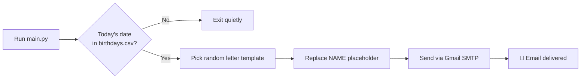

# 🎂 Birthday Wisher

**Never forget a birthday again.** A lightweight Python automation that checks your contact list every day and sends a personalized birthday email — complete with a randomly chosen letter from Ron Weasley.

<p align="center">
  
  
  
  
  
  
  
</p>

---

## ✨ Features

| | |
|---|---|
| 📅 **Date-aware** | Matches today's day & month against your `birthdays.csv` |
| 💌 **Personalized letters** | Picks 1 of 3 templates and fills in `[NAME]` automatically |
| 🎲 **Random variety** | A different letter each year — no copy-paste fatigue |
| 🔐 **Secure credentials** | Email & password live in `.env`, never in code |
| ⚡ **Zero UI needed** | Run once via Task Scheduler / cron and forget it |

---

## 🧠 How it works



1. Load email credentials from `.env`
2. Read `birthdays.csv` and build a lookup by `(day, month)`
3. If someone has a birthday **today**, open a random `letter_templates/letter_*.txt`
4. Replace `[NAME]` with their name and send the email through Gmail

---

## 📁 Project structure

```
Automation/
├── main.py                 # Entry point — checks dates & sends mail
├── birthdays.csv           # Your birthday list
├── requirements.txt        # Python dependencies
├── .env                    # Your secrets (create this — not committed)
└── letter_templates/
    ├── letter_1.txt
    ├── letter_2.txt
    └── letter_3.txt
```

---

## 🚀 Quick start

### 1. Clone & install

```bash
cd Automation
python -m venv venv
venv\Scripts\activate        # Windows
# source venv/bin/activate   # macOS / Linux

pip install -r requirements.txt
```

### 2. Set up Gmail

Gmail blocks normal passwords for SMTP. Use an **App Password**:

1. Turn on [2-Step Verification](https://myaccount.google.com/security) for your Google account
2. Go to [App passwords](https://myaccount.google.com/apppasswords)
3. Create a new app password (e.g. name it `Birthday Wisher`)
4. Copy the 16-character password

### 3. Create `.env`

In the project root, create a file named `.env`:

```env
EMAIL=your.email@gmail.com
EMAIL_PASSWORD=your_16_char_app_password
```

> **Never** commit `.env` or share your app password.

### 4. Add birthdays

Edit `birthdays.csv`:

```csv
name,email,year,month,day
Alice,alice@example.com,1995,3,15
Bob,bob@example.com,1990,12,25
```

| Column | Description |
|--------|-------------|
| `name` | Shown in the letter as `[NAME]` |
| `email` | Where the birthday email is sent |
| `year` | Stored for your records (not used by the script) |
| `month` | Birthday month (1–12) |
| `day` | Birthday day (1–31) |

### 5. Run it

```bash
python main.py
```

If someone has a birthday today, you'll see `Email sent!` in the terminal.

---

## ⏰ Run it automatically every day

The script only does something when there's a match — safe to run daily.

<details>
<summary><b>Windows — Task Scheduler</b></summary>

1. Open **Task Scheduler** → **Create Basic Task**
2. Trigger: **Daily** at 9:00 AM (or your preferred time)
3. Action: **Start a program**
   - Program: `python` (or full path to your venv's `python.exe`)
   - Arguments: `main.py`
   - Start in: `D:\Code Playground\Python-Projects\Automation`
4. Finish and enable the task

</details>

<details>
<summary><b>macOS / Linux — cron</b></summary>

```bash
crontab -e
```

Add (runs daily at 9:00 AM):

```cron
0 9 * * * cd /path/to/Automation && /path/to/venv/bin/python main.py
```

</details>

---

## ✏️ Customize letters

Templates live in `letter_templates/`. Use `[NAME]` anywhere you want the recipient's name inserted.

**Example** (`letter_1.txt`):

```text
Dear [NAME],

Happy birthday!

All the best for the year!

Ron Weasley
```

Add `letter_4.txt`, `letter_5.txt`, etc. and update the random range in `main.py`:

```python
file_path = f"letter_templates/letter_{random.randint(1, 5)}.txt"
```

---

## 🛠️ Troubleshooting

| Problem | Fix |
|---------|-----|
| `Failed to send email` / auth error | Use a Gmail **App Password**, not your regular password |
| No email sent, no error | No birthday matches **today's** date — check `month` and `day` in the CSV |
| `ModuleNotFoundError` | Run `pip install -r requirements.txt` inside your virtual environment |
| Email lands in spam | Ask recipients to mark you as a contact / not spam |

---

## 📜 License

Free to use, modify, and share. If this project helped you brighten someone's day — that's the whole point. 🎉

---

<p align="center">
  Made with ☕ and a little magic — so no birthday slips through the cracks.
</p>
