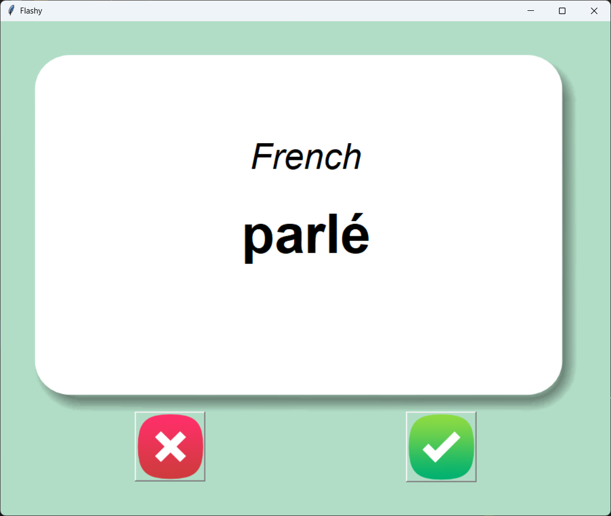
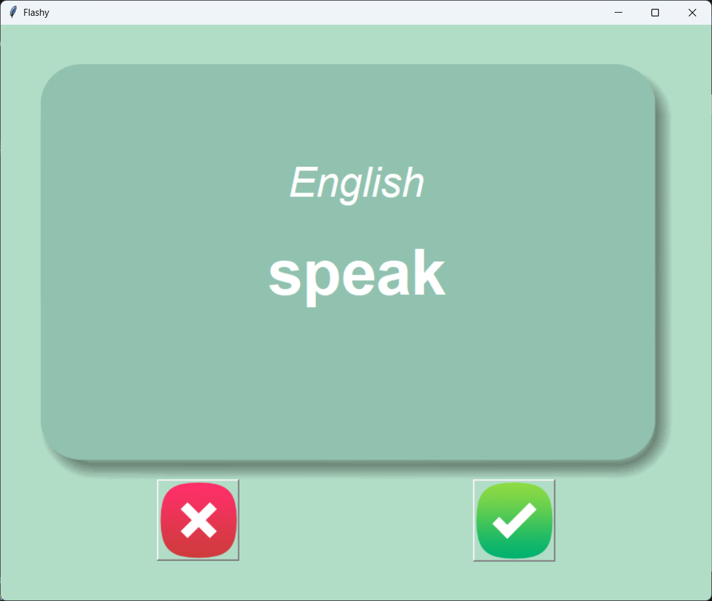

<!-- Flashy – README -->

<a id="readme-top"></a>

<div align="center">

## ⚡ **Flashy**

### *French vocabulary, one flip at a time*

A cozy **desktop flash card app** powered by Python — learn French ↔ English pairs, flip cards automatically, and let the app remember what you still need to master.

<br>

[](https://www.python.org/)
[](https://docs.python.org/3/library/tkinter.html)
[](https://pandas.pydata.org/)

[](https://www.udemy.com/course/100-days-of-code/)
[](https://github.com/)
[](https://en.wikipedia.org/wiki/Comma-separated_values)

[](https://github.com/)
[](https://github.com/)
[](https://github.com/)

<br>

*Flip. Learn. Repeat — until every word feels familiar.* 🇫🇷 ✨

</div>

---

## 🌟 Why Flashy?

Whether you’re following a structured course or just love **tiny, satisfying apps**, Flashy gives you that classic flash card rhythm **without** a browser tab or a subscription.

| | |
|:---|:---|
| 🎯 **Focus** | Only words you *haven’t* nailed yet — progress lives in your data file. |
| ⏱️ **Auto flip** | French on the front; after a few seconds, the card reveals English. |
| 💾 **Your progress** | Known words vanish from the pool; the rest stay for next time. |
| 🖱️ **Two taps** | Green = *I know it*. Red = *show me another* (word stays in the deck). |

---

## 📸 Screenshots


| French (front) | English (back) |
|:---:|:---:|
|  |  |


---

## ✨ Features

- **Flash card flow** — Random French prompt; English answer after a timed flip.
- **Spaced-repetition *style*** — Unknown cards stay in rotation; known ones are written out of your personal list.
- **Persistent deck** — `data/words_to_learn.csv` remembers where you left off between sessions.
- **Friendly UI** — Canvas + card art + big word typography; icon buttons for right/wrong.
- **Zero fuss** — One script: `main.py`. One extra dependency: `pandas`.

---

## 🧠 How it works

1. **Startup** — The app looks for `data/words_to_learn.csv`.  
   - **Found?** Load it — that’s your current “still learning” set.  
   - **Missing?** Start fresh from `data/french_words.csv`.
2. **Each card** — Pick a random row (`French` / `English` columns), show French, then flip after **3 seconds**.
3. **✅ Known** — Remove that word from memory, save the new list to `words_to_learn.csv`, load the next card.
4. **❌ Not yet** — Keep the word in the pool and jump to another card.

Under the hood: **Tkinter** for the window, canvas, and `PhotoImage` assets; **pandas** for reading/writing CSV as a list of dictionaries.

---

## 🚀 Getting started

### 1. Get the code

Flashy lives inside the **[Python-Projects](https://github.com/rugged-code/Python-Projects)** collection, under the GUI folder:

```bash
git clone https://github.com/rugged-code/Python-Projects.git
cd GUI/Flash-Card-Project
```

That path is where `main.py`, `data/`, and `images/` sit — run every command below from **`Flash-Card-Project`** (the app root).

### 2. Virtual environment (recommended)

```bash
python -m venv .venv
.\.venv\Scripts\activate      # Windows
# source .venv/bin/activate   # macOS / Linux
```

### 3. Install dependencies

**pandas** is required. **Tkinter** is included with most official Python builds.

```bash
pip install pandas
```

### 4. Run Flashy

```bash
python main.py
```

You should see the **Flashy** window with a card in the center and the **wrong / right** buttons below.

---

## 🕹️ How to use

1. Read the **French** word on the front of the card.
2. Wait — the card **flips** to **English** automatically.
3. Tap **✅** if you knew it (it leaves your learning file).  
   Tap **❌** if you want another try later (it stays in the deck).
4. Repeat — watch your `words_to_learn.csv` shrink as you improve. 🎉

**Reset progress:** Delete `data/words_to_learn.csv`. Next launch rebuilds from `french_words.csv`.

---

## 🧾 Data files

| File | Role |
|------|------|
| `data/french_words.csv` | Source of truth — all pairs. |
| `data/words_to_learn.csv` | Your live queue; the app creates and updates it. |

---

## 🧩 What you’ll practice

- **Tkinter** — `Tk`, `Canvas`, `Button`, `PhotoImage`, layout with `grid`.
- **Timers** — `window.after` for flip delay and cancel-before-next-card.
- **CSV + pandas** — `read_csv`, `to_dict("records")`, `DataFrame.to_csv`.
- **State** — Current card, list to learn, and saving after each “known” answer.

---

## 💡 Stretch ideas

- Progress bar or “X / Y words left” on the window.
- Custom decks (user-picked CSV or other languages).
- Session stats (streaks, words per minute).
- Themes or dark mode for the chrome around the cards.
- Package with **PyInstaller** for a double-click `.exe` / app bundle.

---

## 🙌 Acknowledgements

This project was built while following **Dr. Angela Yu’s** [**100 Days of Code: The Complete Python Pro Bootcamp**](https://www.udemy.com/course/100-days-of-code/) on Udemy — an excellent path from Python basics to real small projects like this one.

Huge thanks to **Dr. Angela Yu** for the clear teaching, project ideas, and the push to ship something you can actually run on your desktop. This project is my own take on the **Flash Card** milestone: same spirit, same stack, polished for sharing.

---

<div align="center">

**Made with curiosity and ☕ — happy learning!**

[⬆ Back to top](#readme-top)

</div>
