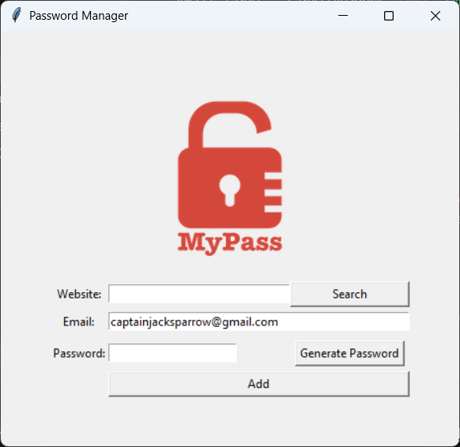

# 🔐 Password Manager

[Python](https://www.python.org/)
[Tkinter](https://docs.python.org/3/library/tkinter.html)
[pyperclip](https://pypi.org/project/pyperclip/)
[JSON](https://www.json.org/)
[Course](https://www.udemy.com/course/100-days-of-code/)

---

A beginner-friendly desktop app to **generate strong passwords**, **save credentials locally**, and **search saved passwords** using Python + Tkinter (part of Angela Yu’s *100 Days of Code*).

> Learning project: it does not provide real security features like encryption.

## ✨ Features

- **🔑 Password generator**  
Generates passwords using:
  - 8–10 letters
  - 2–4 numbers
  - 2–4 symbols  
  Then shuffles the characters to improve randomness.
- **📋 Clipboard integration**  
The generated password is copied automatically using `pyperclip`.
- **💾 JSON storage (`data.json`)**  
Credentials are stored in `data.json` and updated by website key.
- **🧯 Exception handling**  
  - If `data.json` doesn’t exist, it’s created automatically during save.
  - If the JSON file is missing during search, the app shows an informative message.
- **🔎 Search by website**  
Enter a website and click **Search** to view the stored email/password in a popup.
- **✅ Validation + confirmation**  
Shows an error if any field is empty, and asks for confirmation before saving.

## 🗄️ How credentials are stored

Your credentials are saved to `data.json` in this structure:

```json
{
  "github.com": {
    "email": "you@example.com",
    "password": "aB3!xK9mP2vLq"
  }
}
```

## 🚀 Getting started

### Prerequisites

- Python 3.x (3.8+ recommended)
- Tkinter (usually included with Python on Windows)
- `pyperclip`

### Setup

1. Open a terminal in the project folder:
  `Password-Manager/`
2. (Recommended) Create a virtual environment:
  ```bash
   python -m venv .venv
  ```
3. Activate it:

  | OS                   | Command                        |
  | -------------------- | ------------------------------ |
  | Windows (PowerShell) | `.\.venv\Scripts\Activate.ps1` |
  | Windows (CMD)        | `.venv\Scripts\activate.bat`   |
  | macOS / Linux        | `source .venv/bin/activate`    |

4. Install the dependency:
  ```bash
   pip install pyperclip
  ```

### Run the app

Run from the `Password-Manager` folder (so `logo.png` and `data.json` paths resolve correctly):

```bash
python main.py
```

## 🧠 Usage (quick guide)

1. Enter:
  - **Website**
  - **Email**
2. Click **Generate Password**
  - Password appears in the password field
  - It is copied to your clipboard automatically
3. Click **Add**
  - Fill-empty validation runs
  - A confirmation dialog shows your details
  - On successful save:
    - **Website and Password fields clear**
    - **Email stays** (so it’s easy to add multiple entries)
4. Click **Search**
  - Enter the website you want
  - The app shows a popup with the stored **email + password**

## 🖼️ Screenshots / Demo




### Suggested shots

- **Main UI** (website/email/password fields + buttons)
- **Generated password** (showing clipboard flow)
- **Search result popup**
- `**data.json` example** (optional)

## 🧩 Project structure

```text
Password-Manager/
├── main.py       # UI + password generation + JSON save/search logic
├── logo.png      # App logo (required)
├── data.json     # Saved credentials (created/updated by the app)
└── README.md
```

## 🛠️ Troubleshooting

- `**logo.png` not found**  
Run `python main.py` from the `Password-Manager` folder (not a parent directory).
- **Clipboard doesn’t work**  
Reinstall `pyperclip`:
`pip install pyperclip`
- **No `data.json` yet**  
That’s normal. The file is created when you successfully click **Add**.
- **Search shows “No data file found.”**  
Click **Add** at least once to create `data.json`.

## ⚠️ Security notice

This project stores credentials in **plain text JSON** on your machine. There is **no encryption**, no master password, and no secure vault logic.

If you extend this project, consider adding encryption before using it for real accounts.

## 🙌 Acknowledgments

Concepts and structure inspired by **Dr. Angela Yu’s** [100 Days of Code: The Complete Python Pro Bootcamp](https://www.udemy.com/course/100-days-of-code/).