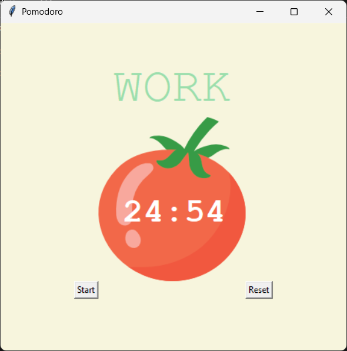

# Pomodoro Timer

A desktop Pomodoro clock built with Python and Tkinter. Focus in timed work blocks, take short breaks, and earn checkmarks as you complete sessions.

Part of my learning journey through [Dr. Angela Yu's 100 Days of Python](https://www.udemy.com/course/100-days-of-code/) (Day 28 project).


## Preview



The UI shows a tomato timer image, a countdown display, **Start** / **Reset** buttons, and checkmarks for completed work sessions.

## Features

- **25-minute work sessions** with automatic transitions
- **5-minute short breaks** after each work block
- **20-minute long break** after every 4 work sessions (8 timer cycles)
- **Session checkmarks** — visual progress with ✔️ marks
- **Reset** — safely stops the timer and clears progress (works even before the first start)
- **Non-blocking countdown** — uses `window.after()` so the GUI stays responsive

## Pomodoro flow

| Phase        | Duration | When                          |
|-------------|----------|-------------------------------|
| Work        | 25 min   | Odd session count             |
| Short break | 5 min    | Even count (not every 8th)    |
| Long break  | 20 min   | Every 8th session (e.g. 8, 16)|

After a session ends, the next phase starts automatically. Click **Reset** anytime to return to `00:00` and clear checkmarks.

## Requirements

- **Python 3.10+** (3.x with Tkinter support)
- **Tkinter** — included with most Python installers (no `pip` packages required)
- **`tomato.png`** — course asset image in the project root (same folder as `main.py`)

### Tkinter on Linux

```bash
# Debian / Ubuntu
sudo apt install python3-tk

# Fedora
sudo dnf install python3-tkinter
```

## Getting started

### 1. Clone the repository

```bash
git clone git clone https://github.com/rugged-code/Python-Projects.git

cd Python-Projects/GUI/Pomodoro
```

### 2. Run the app

```bash
python main.py
```

Optional virtual environment:

```bash
python -m venv .venv

# Windows
.venv\Scripts\activate

# macOS / Linux
source .venv/bin/activate

python main.py
```

## Usage

1. Click **Start** to begin a 25-minute work session.
2. When the timer reaches zero, a break starts automatically.
3. Completed work sessions appear as checkmarks below the timer.
4. Click **Reset** to cancel the countdown and start over.

## Project structure

```
pomodoro-start/
├── main.py
├── tomato.png
├── docs/
│   └── screenshot.png
├── README.md
├── LICENSE
└── .gitignore
```

## Configuration

Edit the constants at the top of `main.py`:

```python
WORK_MIN = 25
SHORT_BREAK_MIN = 5
LONG_BREAK_MIN = 20
```

## What I learned

- Building GUIs with **Tkinter** (`Canvas`, `Label`, `Button`, `PhotoImage`)
- Scheduling updates with **`window.after()`**
- Managing state with **globals** and session counting (`reps`)
- Implementing the **Pomodoro technique** with modulo-based phase logic

## Acknowledgments

- **100 Days of Python** by Angela Yu (Udemy), Day 28
- [Pomodoro Technique](https://francescocirillo.com/pages/pomodoro-technique) by Francesco Cirillo


